# Water Tracker App

Water Tracker is a simple Flutter app designed to help users track their daily water intake. The app is built for Android, iOS, and web platforms and is responsive across various screen sizes, from mobile devices to desktop screens.

## Features

- Track the number of glasses of water consumed daily.
- Available on Android, iOS, and Web.
- Adaptive UI for different screen sizes, using MediaQuery for responsiveness.
- Cross-platform functionality with a smooth user experience.

## Technologies Used

- **Flutter**: For building cross-platform apps.
- **GetX**: For state management.
- **MediaQuery**: For screen size adaptability.
  
## Screenshots

### Android
| 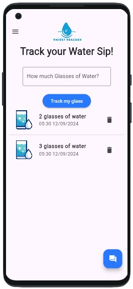 | 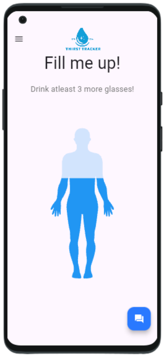 | 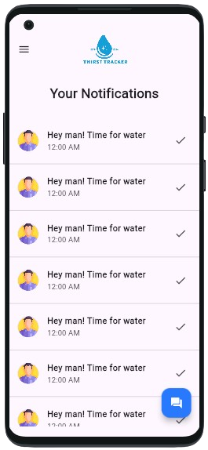 | 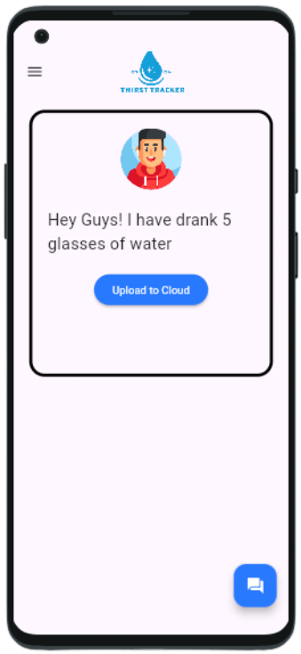 |
|------------------------------------|------------------------------------|------------------------------------|------------------------------------|

### iOS
| 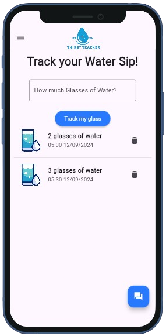 | 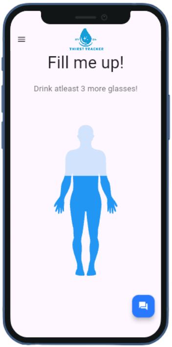 | 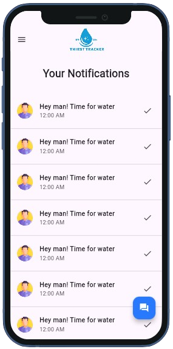 | 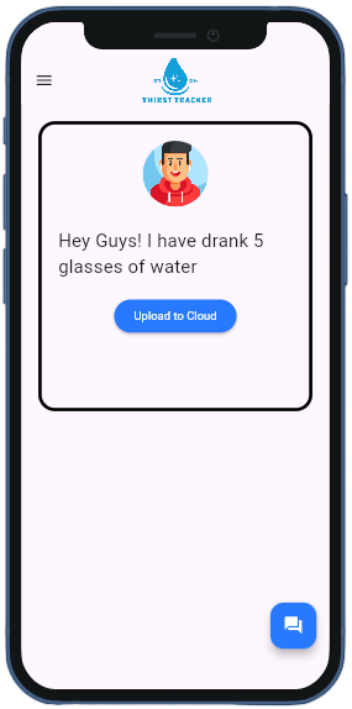 |
|---------------------------------|---------------------------------|---------------------------------|---------------------------------|

### Desktop
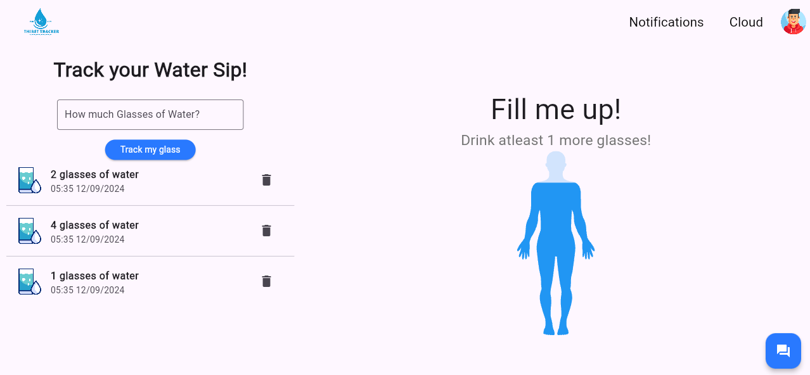
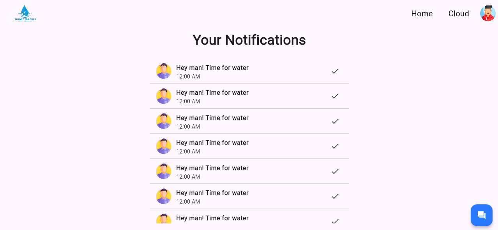
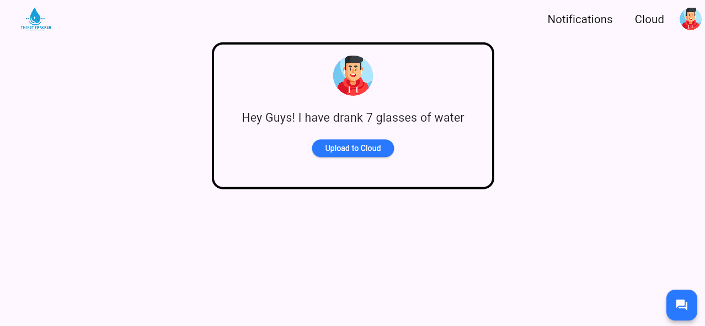

## How to Run

1. Clone the repository:
   ```bash
   git clone https://github.com/your-username/water-tracker-app.git
   ```
2. Navigate to the project directory:
   ```bash
   cd water-tracker-app
   ```
3. Install dependencies:
   ```bash
   flutter pub get
   ```
4. Run the app:
   - For Android: `flutter run`
   - For iOS: `flutter run`
   - For Web: `flutter run -d chrome`

## License

This project is licensed under the MIT License - see the [LICENSE](LICENSE) file for details.